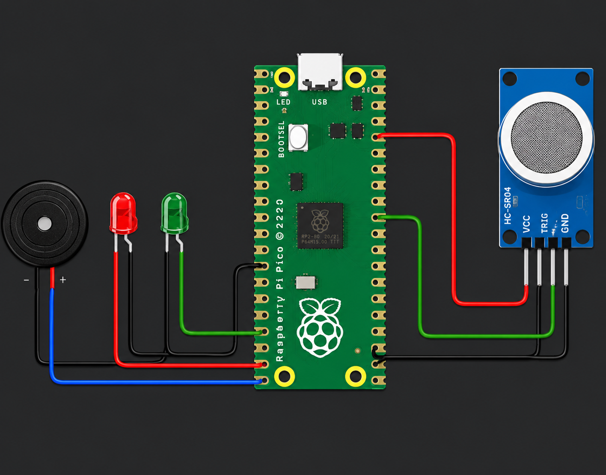
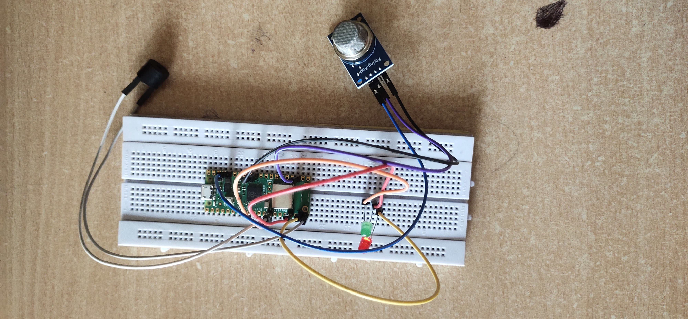

# IoT-Based Smoke Detection System

## Overview
This project is a real-time smoke detection system developed using Raspberry Pi Pico and MQ-2 gas sensor. The system continuously monitors smoke levels and activates a buzzer and LED indicators when smoke concentration exceeds a predefined threshold.

---

## Features
- Real-time smoke monitoring
- MQ-2 gas sensor interfacing
- ADC-based analog signal processing
- Red/Green LED status indication
- Buzzer alert mechanism
- Embedded C firmware

---

## Hardware Components
- Raspberry Pi Pico
- MQ-2 Smoke Sensor
- Buzzer
- LEDs
- Breadboard
- Jumper Wires

---

## Software Requirements
- VS Code
- Raspberry Pi Pico SDK
- CMake
- ARM GCC Compiler

---

## Circuit Connections

| Component | Pico Pin |
|---|---|
| MQ-2 AO | GPIO26 (ADC0) |
| Red LED | GPIO15 |
| Green LED | GPIO14 |
| Buzzer | GPIO13 |

---

## Working Principle
The MQ-2 sensor outputs analog voltage proportional to smoke concentration. The Raspberry Pi Pico reads the analog value using ADC. If the value exceeds the threshold:
- Red LED turns ON
- Buzzer activates

Otherwise:
- Green LED remains ON

---

## Applications
- Home safety systems
- Fire alert systems
- Gas leakage monitoring
- Industrial safety

---

## Future Enhancements
- GSM SMS alerts
- IoT cloud dashboard
- Mobile app integration
- Battery backup monitoring
## Circuit Diagram

## Prototype Setup

## How to Run

1. Connect MQ-2 sensor to GPIO26 (ADC0)
2. Connect LEDs and buzzer to GPIO pins
3. Build the project using Pico SDK
4. Flash the generated .uf2 file into Raspberry Pi Pico
5. Power the board and test using smoke source
